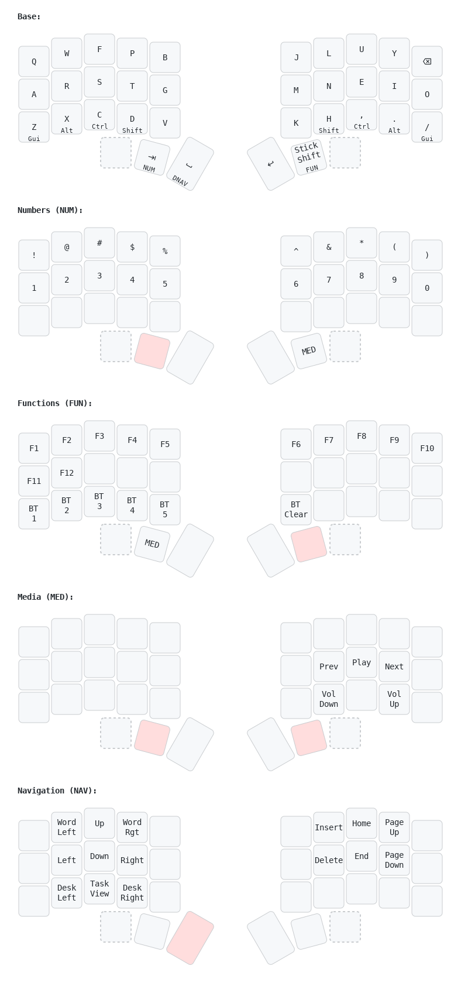
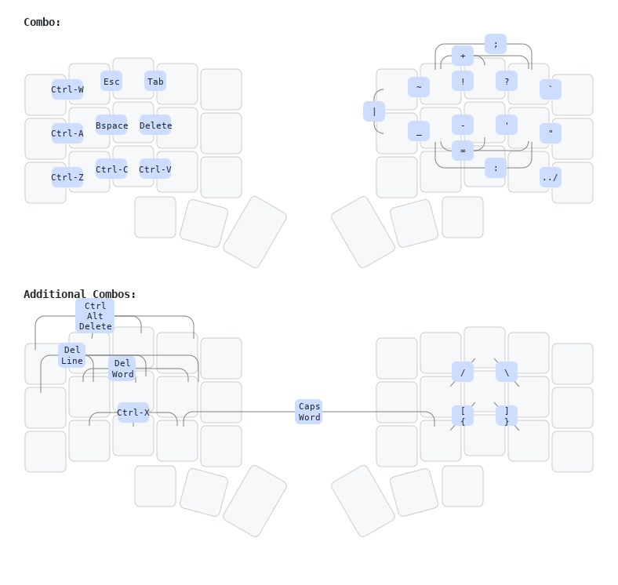

# ZMK Config Sweep

This is my personal keymap's ZMK configuaration. It is designed for 34-key split keyboards, like the Ferris Sweep.

This layout has evolved from a 60% keyboard, originally using QMK, to progressively smaller boards by taking advantages of the many features made available in custom keyboard firmware, in particular combos and numerous thumb-activated layers.

## Highlights

- Colemak-DH alpha base
- Bottom-Row mods, aka Home-row mods on the bottom row
  - Use of both tap-preferred and hold-prefererd Layer-tap options
- TKL layer under home row, for instant access to arrow keys and Home-block
- Heavy use of combos:
  - Utility combos on left hand
  - Symbol character combos on right hand
  - Include 3 and 4-key linear combos, and non-adjacent 2-key combos
- Focus on providing useful functionality with left-hand only, while right hand is using the mouse
  - Copy/paste, delete, backspace combos
  - Desktop navigation layer
  - Arrow cluster layer
- Two layers dedicated to [Komorebi](https://github.com/LGUG2Z/komorebi) Window management
- Desktop navigation layer for management of Windows virtual desktops
- Reduce reliance on outer rows and outer thumb keys for eventual move to 34-key layout

### To Do
- Build a personal version of ZMK to take advantages of features that have not merged to the main ZMK repo. Such as:
  - [Smart-layers for ZMK](https://github.com/zmkfirmware/zmk/pull/1451), especially for the Number layer
  - [tri-state](https://github.com/zmkfirmware/zmk/pull/1366), for an easy alt-tab shortcut
- Find a solution to the conflict between home-row mods and combos (E.g. Holding `CD` will usually trigger the combo placed on the two keys rather than hold `LSFHIT + LCTRL`).

## Keymap



> Drawn with [Keymap Drawer](https://github.com/caksoylar/keymap-drawer)

## Combos

Combos have been very easy to implement and get used to. I quickly added many combos to replace my symbols layer, while also adding extra functionality. The combos are organized by hand; the right hand combos include all the symbols and characters used while typing, whereas the left hand combos cover functionality that can be helpful while my right hand is using the mouse.

### Symbol Combos

* The characters `-`, `'`, `:`, `"` and `=` are available on the homerow, since they are the most common symbol characters in english text. In particular the apostrophe character, due to being placed on `EI` next to `N`, results in a very satisfying roll on the `n't` trigram (I'll admit, more due to luck than planning).
* The symbols `!`, `?`, `;`, `+` `\``, accessible on the top row for easy access while writing code.
* `_` and `~` are less common, and accessed by alt-fingering on the home row and top row respectively.
* The characters also used in programming `/`, `\`, `[ {`, `] }`, and `|` are accessed using non-linear combos. While I generally try to avoid non-linear combos, the shape of those combos match the character, so they do make some sense.
* Finally, a macro for `../` is available on `.` and `/`, which makes navigating backwards in terminal much easier.

### Utility Combos

* `Backspace`, `Delete`, and additional macros for deleting words/lines are available on the left-hand homerow.
* `Esc` and `Tab` on the top row. 
* Copy, Paste and other Ctrl-based commands on the bottow row, plus Select-All (`Ctrl-A`) on `AR`.
* Macros `Select-Line` and `Open new line` are accessible on the alt-finger positions.



> Drawn with [Keymap Drawer](https://github.com/caksoylar/keymap-drawer)

**A few thoughts**:

* As of the current ZMK version, combos may conflict with tap/hold modifiers when activating several modifiers simultaneously. This keymap mostly avoids this issue with bottom-row-mods, so home-row combos are not affected. A few combos are present on the left-hand, so left-hand mods must be pressed sequentially to avoid triggering the combos.
* I found that combos that use only pinky/ring-finger are harder to activate. They require getting used-to, so I'm using only for less commonly used functions.

## Komorebi

[Komorebi](https://github.com/LGUG2Z/komorebi) is a tiling window manager for Windows, and relies on keyboard shortcuts to move windows around. The definition of the shortcuts are defined in the ```whkdrc``` file


> Drawn with [Keymap Drawer](https://github.com/caksoylar/keymap-drawer)
